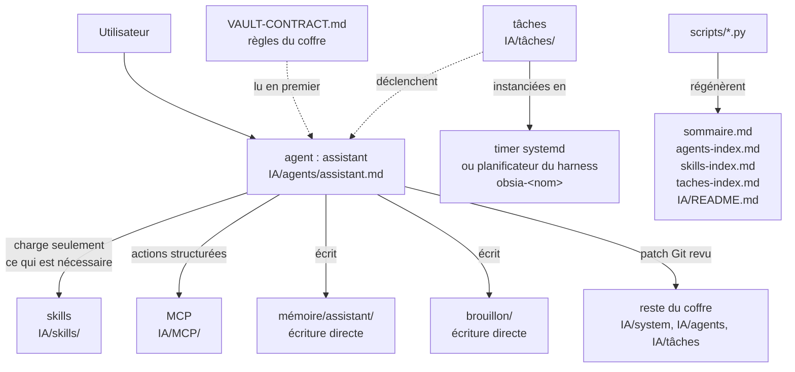

# Schéma — fonctionnement d'OBSIA

Produit par le skill `mermaid` (`IA/skills/mermaid.md`) lors d'un test du
workflow du coffre. Bloc Mermaid brut et non SVG, conformément à la section
« Intégration au coffre » du skill : dans une note du coffre, le bloc reste
lisible, modifiable et versionnable ; le SVG n'est généré que pour un usage
hors coffre.



Le registre `IA/tâches/` fait foi ; l'instance qui déclenche réellement — timer
systemd ou planificateur du harness — en est une copie jetable, et il n'y en a
jamais plus d'une par tâche (§12).

Rendu SVG vérifié hors coffre avec :

```bash
npx -y @mermaid-js/mermaid-cli -p pptr.json -i obsia.mmd -o obsia.svg
```

où `pptr.json` contient `{"args":["--no-sandbox","--disable-gpu","--disable-dev-shm-usage"]}`.
Sans ce fichier, le Chromium de Puppeteer refuse de démarrer en conteneur.
